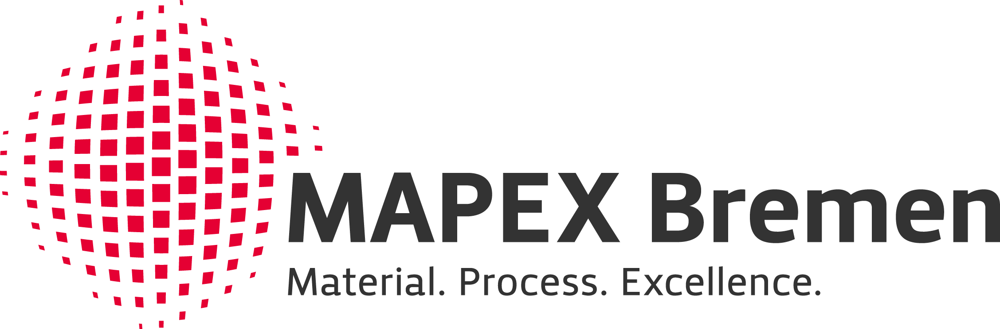

---
myst:
  substitutions:
    aiida_engine_paper: '[*Workflows in AiiDA: Engineering a high-throughput, event-based
      engine for robust and modular computational workflows*](https://doi.org/10.1016/j.commatsci.2020.110086)'
    aiida_main_paper: '[*AiiDA 1.0, a scalable computational infrastructure for automated reproducible workflows and data provenance*](https://doi.org/10.1038/s41597-020-00638-4)'
    esg: "[Excellence Strategy of Germany\u2019s federal and state governments](https://www.dfg.de/en/research_funding/excellence_strategy/index.html)"
    phonopy: '[`phonopy`](https://github.com/phonopy/phonopy)'
    phonopy_documentation: '[`Phonopy` documentation](https://phonopy.github.io/phonopy/install.html)'
    phonopy_paper: '[*First principles phonon calculations in materials science*](http://dx.doi.org/10.1016/j.scriptamat.2015.07.021)'
    readme: '[`README.md` of the repository](https://github.com/aiida-phonopy/aiida-phonopy/blob/develop/README.md)'
    aiida_core_docs: '[`aiida-core`](https://aiida.readthedocs.io/projects/aiida-core/en/latest/intro/get_started.html) documentation'
    aiida_phonopy: '[`aiida-phonopy`](https://github.com/aiida-phonopy/aiida-phonopy)'
    aiida_quantumespresso: '[`aiida-quantumespresso`](https://github.com/aiidateam/aiida-quantumespresso)'
    mapex: '[MAPEX](https://www.uni-bremen.de/en/mapex)'
    ubremen_exc: '[U Bremen Excellence Chair](https://www.uni-bremen.de/u-bremen-excellence-chairs)'
---

```{toctree}
:hidden: true
:maxdepth: 2

installation/index
tutorials/index
howto/index
topics/index
reference/index
citeus
```

::::{grid}
:reverse:
:gutter: 2 3 3 3
:margin: 1 2 1 2

:::{grid-item}
:columns: 12 4 4 4

```{image} images/logo_aiida.svg
:width: 200px
:class: sd-m-auto
```
:::

:::{grid-item}
:columns: 12 8 8 8
:child-align: justify
:class: sd-fs-5

# AiiDA Phonopy

An AiiDA plugin package to integrate the {{ phonopy }} software.
Compute and store phonon related properties of materials with the popular open source {{ phonopy }} code
with automatic data provenance provided by AiiDA.

```{note} New in version 1.2.0
:class: admonition-new
New automated workflow to compute phonons using _any_ ASE calculator! \
Check out the {py:class}`~aiida_phonopy.workflows.ase.PhonopyAseWorkChain` and the new tutorial!
```

**{{ aiida_phonopy }} version:** {{ release }}

:::

::::

______________________________________________________________________


::::{grid} 1 2 2 2
:gutter: 3

:::{grid-item-card} {fa}`rocket;mr-1` Get started
:text-align: center
:shadow: md

Instructions to install, configure and setup the plugin package.

+++

```{button-ref} installation/index
:ref-type: doc
:click-parent:
:expand:
:color: primary
:outline:

To the installation guides
```
:::

:::{grid-item-card} {fa}`info-circle;mr-1` Tutorials
:text-align: center
:shadow: md

Easy examples to take the first steps with the plugin package.

+++

```{button-ref} tutorials/index
:ref-type: doc
:click-parent:
:expand:
:color: primary
:outline:

To the tutorials
```
:::

:::{grid-item-card} {fa}`question-circle;mr-1` How-to guides
:text-align: center
:shadow: md

Hands-on guides to achieve specific goals.

+++

```{button-ref} howto/index
:ref-type: doc
:click-parent:
:expand:
:color: primary
:outline:

To the how-to guides
```
:::

:::{grid-item-card} {fa}`bookmark;mr-1` Topic guides
:text-align: center
:shadow: md

Detailed background information on various concepts.

+++

```{button-ref} topics/index
:ref-type: doc
:click-parent:
:expand:
:color: primary
:outline:

To the topic guides
```
:::

:::{grid-item-card} {fa}`cogs;mr-1` Reference guides
:text-align: center
:shadow: md

Detailed reference guides on the application programming and command line interfaces.

+++

```{button-ref} reference/api/aiida_phonopy/index
:ref-type: doc
:click-parent:
:expand:
:color: primary
:outline:

To the reference guides
```
:::
::::

# How to cite

If you use this plugin for your research, please cite the following works:

> Lorenzo Bastonero and Nicola Marzari, [*Automated all-functionals infrared and Raman spectra*](https://doi.org/10.1038/s41524-024-01236-3), npj Computational Materials **10**, 55 (2024)

> Atsushi Togo and Isao Tanaka, {{ phonopy_paper }}, Scripta Materialia **108**, 1-5 (2015)

> Sebastiaan. P. Huber _et al._, [*AiiDA 1.0, a scalable computational infrastructure for automated
reproducible workflows and data provenance*](https://doi.org/10.1038/s41597-020-00638-4),
Scientific Data **7**, 300 (2020)

> Martin Uhrin, Sebastiaan. P. Huber, Jusong Yu, Nicola Marzari, and Giovanni Pizzi,
{{ aiida_engine_paper }}),
 Computational Materials Science **187**, 110086 (2021)

# Acknowledgements

We acknowledge support from:

:::{list-table}
:widths: 60 40
:class: logo-table
:header-rows: 0

* - The {{ ubremen_exc }} program funded within the scope of the {{ esg }}.
  - 
* - The {{ mapex }} Center for Materials and Processes.
  - 

:::
